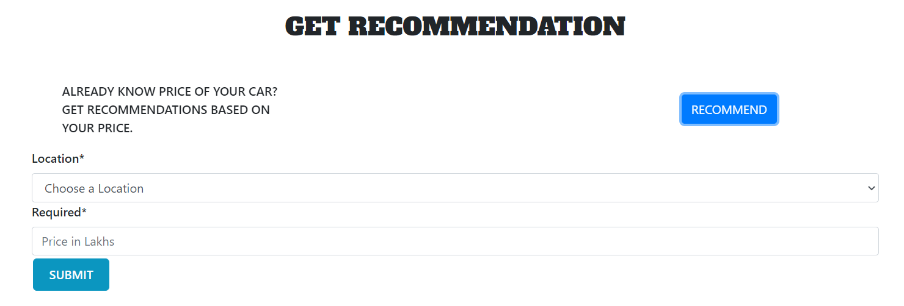
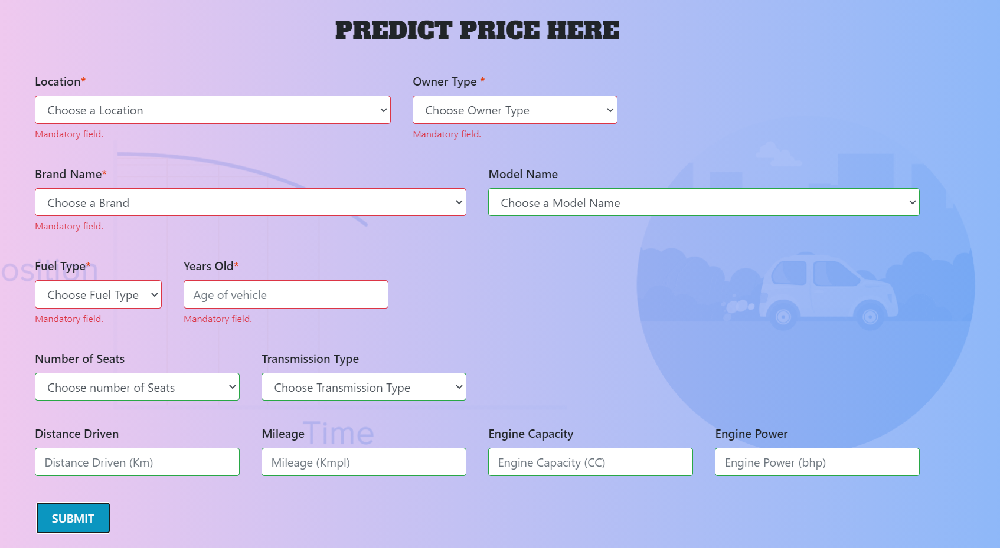
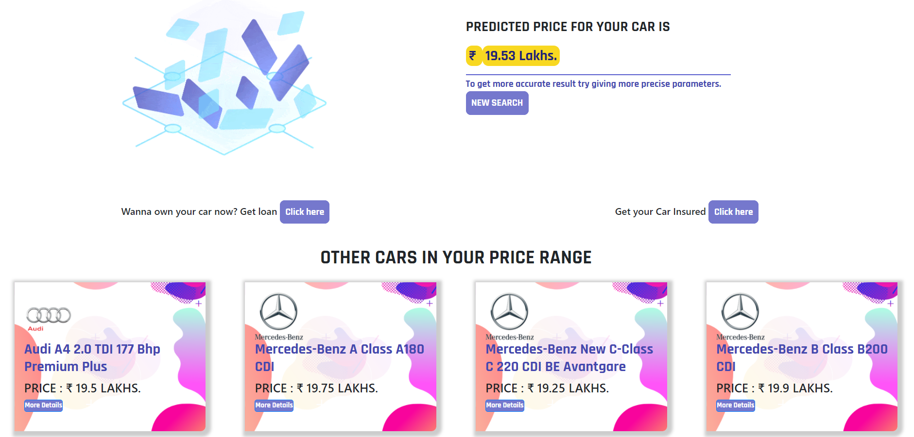
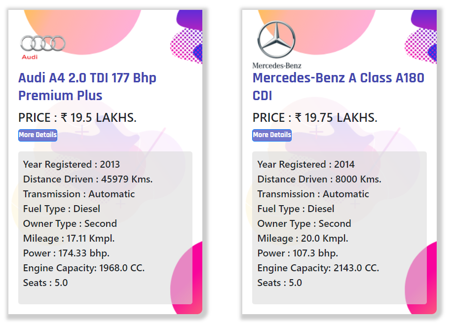

## Used_Car_Price_Prediction

#### This is a Machine Learning based project. It uses Regression techniqur to predict the price of the Used cars.

- XGBoost algorithm is used to make this project
- Flask framework is used to make web server
- Frontend is majorly based on Bootstrap and JS
- Responsive web design.
- Deployed on Heroku cloud
- Refer the ipython notebook for Model building code

Visit the link to access the application:  
https://machineer-prediction.herokuapp.com/  
You can also scan the below QR code to access the application:  

#### Setup
- Clone the repository  
Use git CLI, Zip or other.
- Create a New Conda Environment first  
conda create -n used_Car_price_prediction python=3.6

- Active the created environment  
conda activate used_Car_price_prediction

- Navigate to the root folder of the project where app.py and requirements.txt files are present.

- Install requirements.txt  
pip install -r requirements.txt 
Incase of trouble installing refer <a href="https://stackoverflow.com/questions/7225900/how-can-i-install-packages-using-pip-according-to-the-requirements-txt-file-from#answer-10429168:~:text=pip%20install%20%2Dr%20requirements.txt%20%2D%2Dno%2Dindex%20%2D%2Dfind%2Dlinks%20file%3A%2F%2F%2Ftmp%2Fpackages" target="_blank"> this</a>  StackOverflow Answer

- Launch the Flask Application  
python app.py

#### Application Features
- Get the recommendation of cars for given Location and Price.   

- Get the predicted price given the set of Attributes. Cool part is, no need to enter all the attributes it will be taken care by the algorithm.  

- Along with the predicted price, it will also show the top 20 recommended vehicles within the price range for the given Location. Impressive right!  

- Still not sure about the recommendations? No worries, take a look at more details for all suggestions.  

Hope this will be helpful for implementing and deploying the Machine Learning models.  

